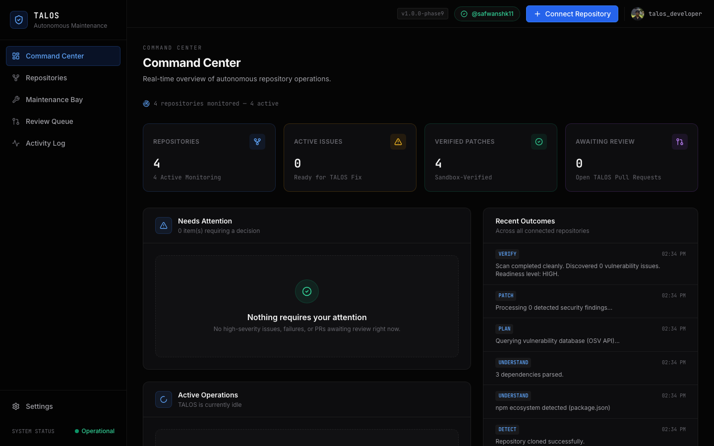
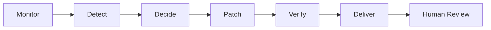
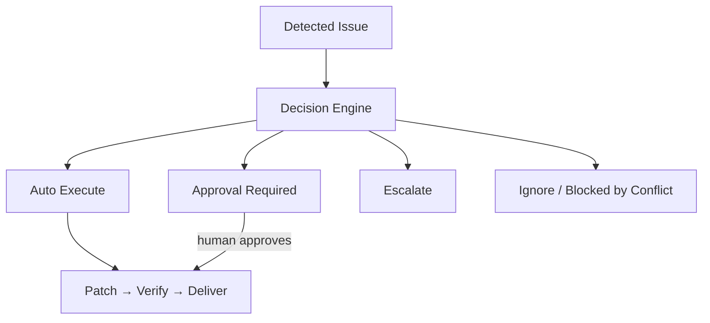
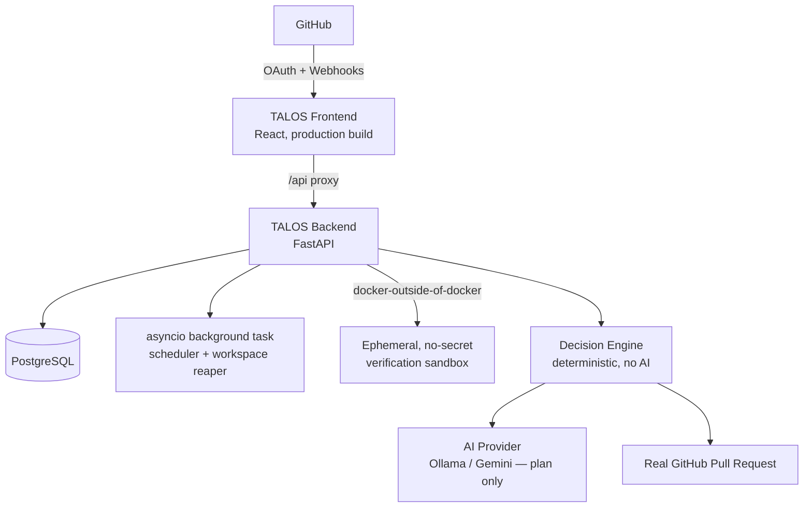
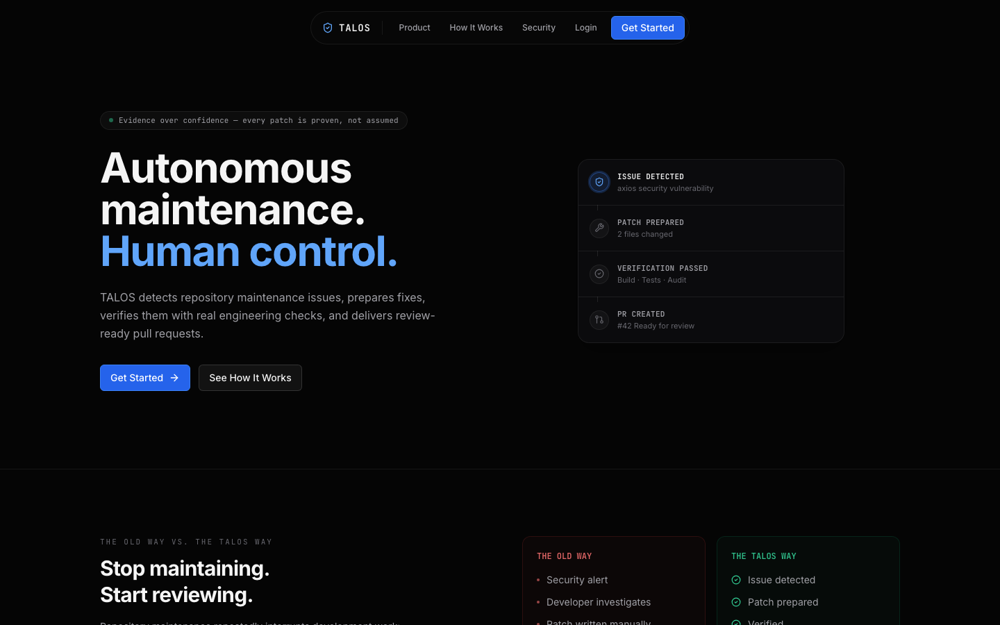
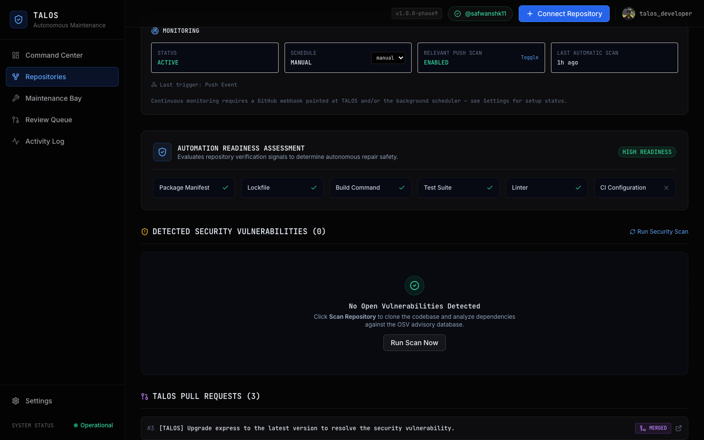
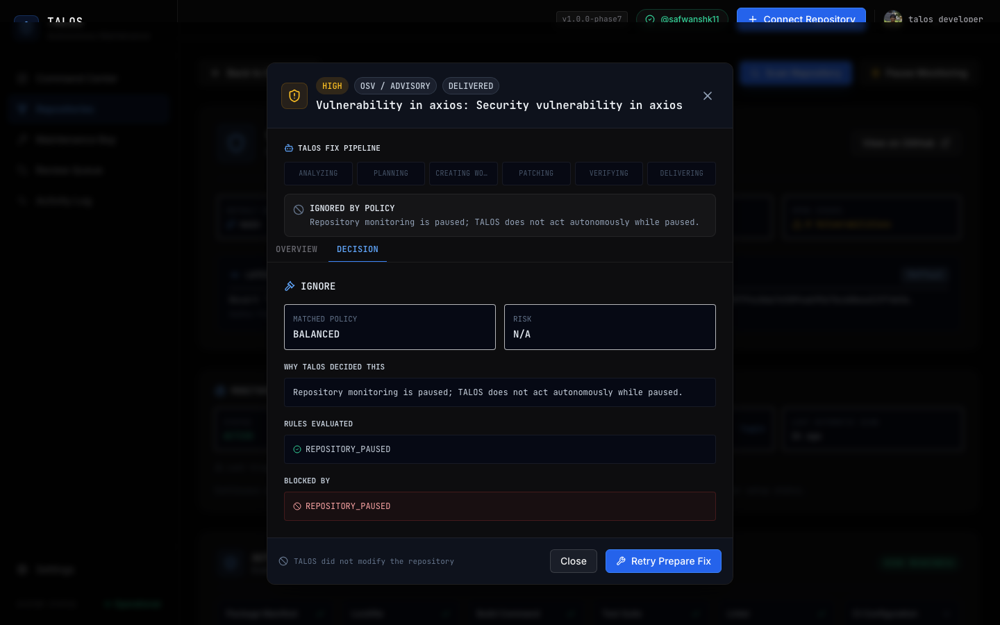
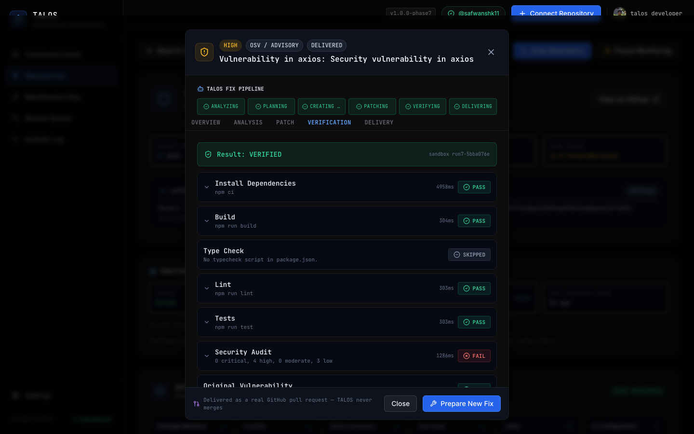
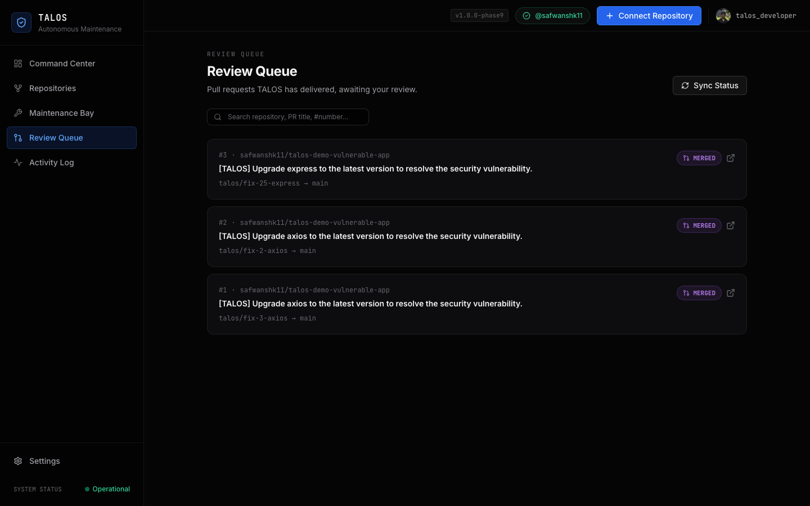

<div align="center">

# TALOS

### Autonomous Repository Maintenance

**Autonomous maintenance. Human control.**

[Live Demo](https://talos-pi.vercel.app/) · [Demo Video](<DEMO_VIDEO_URL>) · [Architecture](#architecture) · [PHASES.md](PHASES.md)

[](LICENSE)
[](backend/requirements.txt)
[](frontend/package.json)
[](docker-compose.yml)

</div>

---



Software repositories continuously accumulate maintenance work: dependencies fall behind, vulnerabilities are published against packages already in production, and someone eventually has to notice, understand the impact, prepare a fix, prove it works, and open a pull request. That work is repetitive, interruptible, and rarely anyone's actual job.

TALOS continuously monitors connected repositories, identifies actionable maintenance work, determines whether autonomous action is permitted, prepares the change, verifies the result through deterministic engineering checks, and delivers a review-ready pull request — while leaving the final merge under human control.

It is built around one governing idea: generating a code change is the easy part. The harder, more interesting engineering problem is deciding *whether an autonomous system should be allowed to make that change at all*, and proving the result is actually safe to hand to a human for review.

---

## Core Workflow



The Decision step is not a formality — it can route a detected issue three different ways before any repository file is touched:

```text
AUTO_EXECUTE        → TALOS proceeds through Patch → Verify → Deliver on its own
APPROVAL_REQUIRED    → TALOS prepares the plan, then waits for a human to approve or reject it
ESCALATE             → TALOS stops. Zero files modified.
```

(Two further outcomes exist for completeness: `IGNORE` — a duplicate or paused-repository trigger that shouldn't act — and `BLOCKED_BY_CONFLICT` — a repository already has a mutating job in flight.)

---

## Why TALOS?

Generating code is not enough for autonomous maintenance. The harder question is whether an autonomous system should be permitted to modify a repository at all — and whether the resulting change can be proven safe enough to deliver for review.

TALOS's answer is a fixed sequence, and none of the steps are optional:

```text
DETECT
    ↓
UNDERSTAND
    ↓
DECIDE WHETHER TO ACT
    ↓
PERFORM THE WORK
    ↓
VERIFY THE RESULT
    ↓
DELIVER ONLY IF VERIFIED
```

The Decision step and the Verification step are both deterministic — no AI model participates in either. An AI provider is used exactly once in the pipeline, to analyze a detected issue and draft a structured fix plan. It never decides whether that plan is safe to execute, and it never gets to grade its own work.

### What TALOS is not

TALOS is not a chatbot, a code-suggestion box, an auto-merge bot, or a thin wrapper that hands a repository to an LLM and trusts whatever comes back. It is designed around execution rather than conversation: it performs real repository maintenance workflows — real clones, real branches, real verification runs, real pull requests — and records the evidence behind every action it takes, in an Action Ledger a human can read afterward.

---

## Core Capabilities

**Continuous Repository Monitoring** — an opt-in per-repository schedule (manual / daily / weekly) plus a signature-verified GitHub webhook (`push`, `pull_request`) trigger a scan without anyone keeping the UI open. A push is only acted on if it touches a maintenance-relevant file (`package.json`, a lockfile, `requirements.txt`) on the default branch, and TALOS recognizes and ignores pushes to its own branches to prevent a self-trigger loop.

**Maintenance Detection** — dependency parsing (npm/pip manifests and lockfiles) plus a real query against the [OSV.dev](https://osv.dev) vulnerability database. No hardcoded advisory data.

**Decision Engine** — a pure, deterministic function (no AI, no network call) that evaluates issue severity, patch risk, repository readiness, the repository's automation policy, protected paths, and any conflicting in-flight work, and returns one of `AUTO_EXECUTE` / `APPROVAL_REQUIRED` / `ESCALATE` / `IGNORE` / `BLOCKED_BY_CONFLICT`.

**Protected Areas & Policy** — each repository has an automation policy (Conservative / Balanced / Autonomous presets, or manual per-tier overrides) and a list of protected path globs. A change touching a protected path, or classified as a major/high-risk update, can never be `AUTO_EXECUTE` — enforced server-side, not just hidden in the UI.

**AI-Assisted Patch Planning** — Ollama (local) or Gemini (deployment) analyzes the issue and proposes a structured plan. The actual dependency version change is then applied deterministically (`npm install --package-lock-only`, or a real PyPI lookup + regex rewrite of `requirements.txt`) — the model never hand-writes the edit.

**Deterministic Verification** — a disposable, no-secrets Docker sandbox runs install, build, tests, and a security audit, then re-queries OSV to confirm the original advisory is actually gone. Each check reports `PASS`, `FAIL`, or `SKIPPED` honestly — an unavailable check is never reported as a pass.

**GitHub Delivery** — an isolated branch, a real push, and a real pull request via the GitHub REST API. A SHA-hash check confirms the artifact about to be delivered is byte-identical to what was verified before anything is pushed.

**Action Ledger** — every pipeline step, on every job, is written to an auditable log — what was scanned, what was decided and why, what was checked, what shipped.

**Human Control** — TALOS opens pull requests. It does not merge them, in any configuration.

---

## Policy-Governed Autonomy

TALOS does not treat every detected issue the same way. Before a single file changes, the Decision Engine evaluates:

```text
issue severity              repository automation policy
patch risk (patch/minor/major)   protected paths
repository readiness (build/test/CI signals present)  verification capability
existing in-flight jobs      existing open pull requests
```



## Hard Safety Boundaries

These are invariants enforced in the backend, not conventions the UI happens to follow — a direct API call is held to the same rules as a button click:

- Unverified patches are never delivered.
- A protected path or a high-risk change is escalated, never auto-patched.
- An `APPROVAL_REQUIRED` hold cannot be bypassed by calling the pipeline again.
- A paused repository performs no autonomous action — confirmed live in this project's own demo history (a job on a paused repository was correctly refused with `decision=IGNORE`, `blocked_by=REPOSITORY_PAUSED`).
- TALOS never automatically merges a pull request.

## Verification Before Delivery

Generated code is treated as **untrusted until verified**. A patch reaching `PATCH_READY` has not proven anything yet — it is a candidate.

```text
PATCH GENERATED
      ↓
DEPENDENCIES INSTALLED
      ↓
BUILD
      ↓
TESTS
      ↓
SECURITY AUDIT
      ↓
ORIGINAL ISSUE RECHECK (real second OSV query)
      ↓
VERIFIED
```

Every check resolves to `PASS`, `FAIL`, or `SKIPPED` — never silently upgraded to a pass because a check wasn't available. If verification fails, delivery is blocked. That's not a fallback path; it's the only path.

---

## Architecture



There is no Redis, Celery, or separate job-queue/worker service. Scheduling and workspace reclamation run as an `asyncio` background task inside the same FastAPI process — a deliberate choice, correct and sufficient for a single backend instance, not an omission. See [Known Limitations](#known-limitations) for what that trades off.

**Frontend** — the operational interface: Command Center, repository registry/detail, Maintenance Bay, Review Queue, Activity Ledger.

**Backend (FastAPI)** — authentication, repository state, GitHub integration, and orchestration of every pipeline stage.

**Decision Engine** — a pure function, no AI, no network call, that determines the permitted autonomy level for a given issue.

**AI Provider** — semantic analysis and patch planning only, behind a pluggable interface (Ollama or Gemini).

**Verification Engine** — launches an isolated, ephemeral Docker container (docker-outside-of-docker) for each check, with no TALOS secrets and no access to TALOS's own internal network.

**GitHub Integration** — OAuth/PAT authentication, repository metadata, webhook intake, branch pushes, pull request creation.

### Where AI is used

**AI / semantic reasoning**
```text
repository/issue understanding
maintenance plan generation
```

**Deterministic systems (no AI involved)**
```text
policy enforcement (Decision Engine)
protected-path checks
webhook signature verification
dependency version application
build / test / security-audit execution
verification gating
pull request artifact-integrity checks
```

TALOS's safety properties do not depend on the AI model behaving correctly — they hold even if the model's output is wrong, because nothing downstream trusts it without independent verification.

### AI providers

| Provider | Role |
|---|---|
| **Ollama** | Local model inference — used in local development |
| **Gemini API** | Google's hosted API — used in any real deployment |

Both sit behind the same `AIProvider` interface. There is no automatic fallback between them — the active provider is a single configuration value (`AI_PROVIDER`), and a startup check fails loudly in a production environment if it's set to `gemini` without a `GEMINI_API_KEY`.

---

## Security Model

- **GitHub webhook signature verification** — inbound webhooks are HMAC-SHA256 verified against a configured secret before any processing; no secret configured means every request is refused, not silently trusted.
- **Backend-enforced authorization** — every repository-scoped endpoint filters by the authenticated user's ID at the service layer. In `ENVIRONMENT=production`, a missing or invalid session token is a hard `401`; a local-development convenience fallback (auto-provisioning a default user) is disabled outside development.
- **Protected repository paths** — a policy-defined set of path globs that can never be modified under `AUTO_EXECUTE`.
- **Verification before delivery** — see above; enforced server-side, not optional.
- **Repository content is treated as untrusted input.** README text, source comments, and issue text feed into AI context for analysis, but cannot redefine TALOS's policy, decision logic, or verification requirements — those live entirely outside the model's control.
- **Secret isolation** — the verification sandbox receives no `-e`/`--env-file` flags; TALOS's GitHub token, AI provider key, database credentials, and JWT signing key are never forwarded into it.
- **Human-controlled merge boundary** — TALOS opens pull requests. A human merges them.

---

## Product Tour

| | |
|---|---|
|  Landing |  Command Center |
|  Repository Detail |  Decision Engine |
|  Verification Report |  Review Queue |

All captured from the live, running product against real data — the connected demo repository's actual pull-request and job history, not mockups. Four more (Login, Repository Registry, Maintenance Bay, Activity Ledger) are in [`docs/screenshots/`](docs/screenshots/).

---

## Tech Stack

| Layer | Technology |
|---|---|
| Frontend | React 18, TypeScript, Vite, React Router v6, Framer Motion, Tailwind (custom design system) |
| Backend | FastAPI, Python 3.11, async SQLAlchemy 2.0, Pydantic v2, HTTPX |
| Database | PostgreSQL 16 |
| Scheduling | In-process `asyncio` background task — no queue/worker service |
| AI | Ollama (local) or Google Gemini (deployment), behind one `AIProvider` interface |
| Verification Sandbox | Docker (docker-outside-of-docker) |
| GitHub Integration | REST API — OAuth, webhooks, pushes, pull requests |
| Containers | Docker & Docker Compose |

---

## Repository Structure

```text
talos/
├── frontend/                          # React + TypeScript operations dashboard
│   ├── src/
│   │   ├── components/                # Sidebar, Header, IssueDetailModal, DiffViewer,
│   │   │                               # VerificationReport, ErrorBoundary, ui/ primitives
│   │   ├── pages/                     # Command Center, Repository Registry/Detail,
│   │   │                               # Maintenance Bay, Review Queue, Activity, Settings
│   │   ├── hooks/ lib/ services/ types/
│   │   └── index.css
│   └── Dockerfile                     # tsc + vite build, served by vite preview
├── backend/                           # FastAPI service
│   ├── app/
│   │   ├── api/v1/                    # auth, repositories, health, webhooks
│   │   ├── core/                      # config + startup validation, JWT
│   │   ├── db/ models/ schemas/
│   │   └── services/
│   │       ├── ai/                    # AIProvider + Ollama/Gemini
│   │       ├── decision_service.py    # Decision Engine + policy/conflict
│   │       ├── verification/          # sandbox execution, plan builder
│   │       ├── delivery_service.py    # push, PR creation, integrity check
│   │       ├── monitoring_service.py  # scheduler, webhook intake, reaper
│   │       └── scanner_service.py     # dependency + OSV scan pipeline
│   └── tests/                         # pytest
├── docs/                              # screenshots, submission materials, release checklist
├── scripts/demo-preflight.sh
├── docker-compose.yml
├── .env.example
├── PHASES.md                          # full phase-by-phase build history
└── README.md
```

---

## Getting Started

### Prerequisites

- Git
- Docker & Docker Compose
- A running Docker daemon (the backend mounts `/var/run/docker.sock` to launch verification sandboxes)
- A GitHub account and either a Personal Access Token or an OAuth App
- Ollama running locally, **or** a Gemini API key

### Quick Start (Docker Compose)

```bash
git clone https://github.com/safwanshk11/talos.git
cd talos

cp .env.example .env

docker compose up --build
```

- Dashboard: [http://localhost:3000](http://localhost:3000)
- API docs: [http://localhost:8000/docs](http://localhost:8000/docs)
- Health check: [http://localhost:8000/api/v1/health](http://localhost:8000/api/v1/health)

<details>
<summary>Manual setup (without Docker)</summary>

Requires PostgreSQL running locally (`talos_db` / `talos` / `talos_secret_pass`, or set `LOCAL_DATABASE_URL`).

```bash
# Backend
cd backend
python3 -m venv venv && source venv/bin/activate
pip install -r requirements.txt
uvicorn app.main:app --reload --port 8000

# Frontend
cd frontend
npm install
npm run dev
```

</details>

### Environment Variables

The full, current list — including verification-sandbox timeouts/limits — is in [`.env.example`](.env.example). The ones you'll actually need to set:

| Variable | Required | Purpose |
|---|:---:|---|
| `SECRET_KEY` | Yes (prod) | JWT signing secret — TALOS refuses to boot in `ENVIRONMENT=production` if left at the published default |
| `ENVIRONMENT` | No | `development` (default, permissive) or `production` (fail-fast config validation, hard auth enforcement) |
| `DATABASE_URL` | Yes | PostgreSQL connection string |
| `GITHUB_CLIENT_ID` / `GITHUB_CLIENT_SECRET` | No | GitHub OAuth App — omit to use Personal Access Token login instead |
| `AI_PROVIDER` | Yes | `ollama` or `gemini` |
| `OLLAMA_BASE_URL` | If `ollama` | Ollama server URL (`http://host.docker.internal:11434` from Docker on macOS/Windows) |
| `GEMINI_API_KEY` | If `gemini` | Required — TALOS refuses to boot in production without it when `AI_PROVIDER=gemini` |
| `GITHUB_WEBHOOK_SECRET` | For webhooks | HMAC secret matching the GitHub repository's webhook configuration |

### GitHub Setup

TALOS supports two login paths — a Personal Access Token (fastest for local use) or a GitHub OAuth App. Either way it requests `repo` + `user` scope: read/write access to repository content (to clone, branch, and push) and basic profile info. It does not request organization-wide or admin scopes.

For continuous monitoring via webhooks (optional — scheduled/manual scanning works without it): point a GitHub repository webhook at `POST /api/v1/webhooks/github` with the same secret as `GITHUB_WEBHOOK_SECRET`, subscribed to `push` and `pull_request` events. This requires a publicly reachable backend URL (e.g. via ngrok for local development).

### AI Provider Setup

**Ollama** (local development) — install Ollama, pull the configured model (default `qwen2.5:7b`), and set `AI_PROVIDER=ollama`.

**Gemini** (deployment) — set `AI_PROVIDER=gemini` and `GEMINI_API_KEY`. Default model: `gemini-2.0-flash`.

Only one provider is active at a time; there is no automatic fallback between them.

---

## Testing

```bash
cd backend
pytest
```

Covers the Decision Engine (all five outcomes, precedence ordering, protected-path/policy validation), continuous-monitoring logic (webhook signature verification, event deduplication, scheduler due-checks, real `TestClient` webhook requests against a live database), and core API behavior. There is currently no automated frontend test suite — `npm run lint` runs ESLint, and `npm run build` runs a real `tsc` typecheck ahead of the production Vite build, but neither is a substitute for real component/integration tests.

---

## Demo

- **Live Application:** [https://talos-pi.vercel.app/](https://talos-pi.vercel.app/)
- **Demo Video:** `<DEMO_VIDEO_URL>`
- **Demo Repository:** [`safwanshk11/talos-demo-vulnerable-app`](https://github.com/safwanshk11/talos-demo-vulnerable-app) — a small, controlled repository with a real, currently-open vulnerability, kept intentionally separate from the TALOS source repository itself. It already has real history: three pull requests TALOS opened and a human merged.

Typical scenario:

```text
1. Connect a repository
2. TALOS detects a vulnerable dependency (real OSV query)
3. Decision Engine evaluates whether autonomous action is permitted
4. TALOS prepares a patch on an isolated branch
5. Verification runs in a disposable, no-secrets sandbox
6. A verified patch becomes a real GitHub pull request
```

---

## Known Limitations

- **No Redis/queue/worker service.** Scheduling and workspace reclamation are in-process `asyncio` tasks — correct for one backend instance, does not horizontally scale to multiple.
- **Single-tenant auth.** GitHub OAuth/PAT genuinely verifies against the real GitHub API, but each deployment currently serves one implicit local account rather than real multi-user tenancy.
- **No formal database migration tooling.** Alembic is installed but unused; schema evolves via idempotent `ADD COLUMN IF NOT EXISTS` statements at startup.
- **GitHub PAT is stored in plaintext**, not encrypted at rest.
- **Live job cancellation is unavailable** — a running scan/patch/verification runs to completion or failure.
- **Autonomous repair retries are intentionally limited.** A failure is surfaced honestly rather than silently retried into a different outcome.
- **Security-audit verification currently targets npm-based projects most deeply**; unsupported ecosystem checks are explicitly reported `SKIPPED` rather than treated as passing.
- **The verification sandbox has outbound internet access** (required for `npm install`/`pip install` to resolve packages) — isolated from TALOS's own internal services, not from the public internet.
- **TALOS never automatically merges a pull request, under any configuration.** Permanent, not a current-version gap.

## Future Work

- Additional package ecosystems beyond npm/pip
- Real multi-tenant authentication and authorization
- Organization-level policy management
- Additional verification adapters (more languages/frameworks)
- Developer notification integrations
- Stronger execution isolation for the verification sandbox

---

## BYAMN Buildathon 2026

TALOS was built for the BYAMN Buildathon 2026. See [`docs/SUBMISSION.md`](docs/SUBMISSION.md) for the full submission materials, and [`PHASES.md`](PHASES.md) for the complete build history.

## AI Usage

**Development assistance:** Claude (Anthropic), via Claude Code — used throughout this project's design, implementation, debugging, and its own pre-submission security audit.

**Runtime AI:** Ollama (local development) or Gemini (deployment), used only to analyze a detected issue and draft a structured fix plan — see [Where AI is used](#where-ai-is-used) above for exactly what it does and does not control.

## License

[MIT](LICENSE)

---

<div align="center">

**TALOS**

Autonomous maintenance. Human control.

</div>
